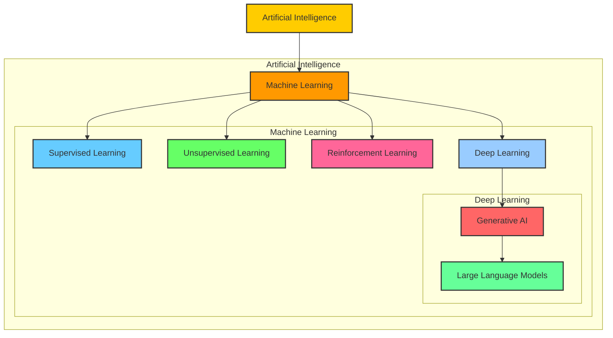

# AI and Its Subfields

## Artificial Intelligence (AI)
Artificial Intelligence (AI) is a branch of computer science that aims to enable computer systems to simulate human intelligence, solve problems, and complete tasks.

## Machine Learning (ML)
Machine Learning (ML) is a subset of AI, focusing on allowing computers to learn patterns, make predictions, and make decisions through algorithms without explicit programming.

### Supervised Learning
In supervised learning, machine learning algorithms receive labeled training data, where each data point contains both input features and the expected output. The goal is to learn the mapping between inputs and outputs, enabling accurate predictions for new data.  
- **Classification**: Assigns data to different categories.  
- **Regression**: Predicts numerical values.

### Unsupervised Learning
Unlike supervised learning, unsupervised learning deals with unlabeled data. The algorithm autonomously discovers patterns or structures in the data.  
- **Clustering**: Groups similar data points together.

### Reinforcement Learning (RL)
Reinforcement learning enables models to take actions in an environment, receive feedback, and learn from it. The goal is to maximize rewards or minimize losses by determining the best action in a given scenario.

---

# Deep Learning and Neural Networks

## Deep Learning
Deep learning is a method within machine learning that utilizes artificial neural networks to process and represent data hierarchically. It mimics how the human brain processes information.

## Neural Networks
Neural networks consist of many fundamental computational and storage units called neurons. These neurons are connected in layers to process data. Deep learning models typically contain multiple layers, which is why they are called "deep."

## Relationship to Other Learning Types
Deep learning can be applied to supervised learning, unsupervised learning, and reinforcement learning. It is not a subset of any of these but rather a method that enhances them.

---

# Generative AI and AI-Generated Content (AIGC)

## Generative AI
Generative AI is an application of deep learning that leverages neural networks to identify patterns and structures in existing content to generate new content. The generated content can take various forms, including text, images, and audio.

## AI-Generated Content (AIGC)
AIGC refers to the content created by Generative AI. The output generated by Generative AI is considered AIGC.

---

# Large Language Models (LLMs) - Part 1

## What Are LLMs?
Large Language Models (LLMs) are a specialized application of deep learning designed for natural language processing (NLP) tasks. The "large" in LLM refers to the vast number of parameters in the model, often ranging from billions to trillions.

## How LLMs Work
LLMs are trained on massive text datasets and excel in understanding and generating high-quality text. For example, GPT-3 generates text based on input prompts by calculating probabilities and predicting the next word or token in a sequence.

# Visualization

### Explanation:
- **AI** is the largest set.
- **Machine Learning (ML)** is a subset of AI.
- **Supervised Learning (SL), Unsupervised Learning (UL), and Reinforcement Learning (RL)** belong to ML.
- **Deep Learning (DL)** is a specialized method within ML.
- **Generative AI (GA)** emerges from Deep Learning.
- **Large Language Models (LLM)** are a specialized type of Generative AI.

# Large Language Models (LLM) - Part 2

Large Language Models (LLMs) are deep learning models designed for natural language tasks. By inputting textual content, the model can generate corresponding outputs for various tasks, such as generation, classification, summarization, rewriting, and more. 

LLMs are trained using vast amounts of text data. For example, GPT-3’s training data spans multiple internet text corpora, including online books, news articles, scientific papers, Wikipedia, and social media posts. By leveraging these large datasets, the model learns the relationships between words and contexts, improving its ability to understand text and generate accurate predictions.

The "large" in LLMs refers not only to the vast training data but also to the huge number of parameters. Parameters are internal variables that represent the knowledge acquired during training. The number of parameters in a model determines how it responds to input data, influencing its behavior. As research progressed, it was discovered that using more data and computational power to train models with more parameters often leads to better performance. Today, language models contain significantly more parameters than before. For instance:
- GPT-1 has 117 million parameters.
- GPT-2 has 1.5 billion parameters.
- GPT-3 has 175 billion parameters.

The increase in parameters means that large models are no longer limited to performing a single or a few tasks but can handle a broad range of tasks, such as summarization, classification, extraction, etc., without requiring separate models for each task.

---

# Transformer Architecture

In June 2017, the Google team published the paper "Attention is All You Need," which introduced the Transformer architecture. This breakthrough changed the direction of natural language processing (NLP), leading to a series of models based on the Transformer architecture.

The Transformer architecture underpins models like GPT (Generative Pre-trained Transformer). The key component of these models is the Transformer, which is essential for understanding and processing text in LLMs.

---

# Recurrent Neural Networks (RNN) and Their Limitations

Before the Transformer, the dominant architecture for language models was Recurrent Neural Networks (RNNs). RNNs process input sequentially, where each output depends on the previous hidden state and the current input. As a result, RNNs cannot perform parallel computations, making training inefficient. Additionally, RNNs struggle with handling long sequences of text due to their inability to maintain long-range dependencies between words. The farther apart words are in the sequence, the weaker the influence of earlier words on later ones.

To address this, Long Short-Term Memory (LSTM) networks were introduced as an improvement to RNNs. However, LSTMs did not solve the parallelization problem, and they still faced limitations when processing very long sequences.

---

# The Transformer: Solving Long-Range Dependencies

The Transformer model was designed to overcome the limitations of RNNs and LSTMs. It can learn the relationships and context between all words in an input sequence, regardless of their distance from each other. The key innovation that enables the Transformer to capture these long-range dependencies is the self-attention mechanism.

In simple terms, the Transformer does not only focus on the current word and its neighboring words; it also pays attention to all other words in the sequence and assigns different attention weights to each word. These attention weights are learned by the model during training, allowing the Transformer to understand the strength of relationships between words, even if they are far apart.

# Key Innovations: Self-Attention and Positional Encoding

Two key innovations make the Transformer model highly effective:

1. **Self-Attention Mechanism**:
   - When processing each word, the Transformer not only looks at the word itself and nearby words but also considers the entire sequence of words, giving each word different attention weights. This enables the model to capture long-range dependencies in a text.

2. **Positional Encoding**:
   - Unlike RNNs, which process text sequentially, the Transformer can process all words in the sequence simultaneously. To preserve the order of words, positional encoding is added to each word before it is fed into the model. This encoding helps the model understand the order of words in a sentence, allowing it to maintain the correct sequence during processing.

These innovations make the Transformer capable of parallelizing computation and significantly improving training efficiency. With the ability to process input sequences in parallel and capture long-range dependencies, the Transformer has become the foundation for modern LLMs.

---

# Transformer - Encoder & Decoder

## 1. Input Processing

The Transformer begins by processing the input text through several steps:

- **Tokenization:**  
  The input sentence is first split into tokens—the basic units of text. Depending on the tokenization method, short words may correspond to a single token, while longer words might be divided into multiple tokens.

- **Token IDs:**  
  Each token is then converted into a unique integer (token ID) because computers operate with numerical data rather than raw text.

- **Embedding:**  
  These token IDs are mapped to dense vectors (embeddings). An embedding represents a token as a series of numbers that capture semantic and syntactic properties. Similar words tend to have embeddings that are close to one another in the vector space, enabling the model to understand nuances like meaning and context.

## 2. Positional Encoding

Since the Transformer architecture itself lacks any inherent notion of sequence order, positional encoding is crucial:

- **Purpose:**  
  Positional encodings inject information about the position of tokens in the sequence.

- **Method:**  
  A positional vector (indicating the token’s position) is added to the token’s embedding. This allows the model to capture the order of words, which is essential for understanding syntax and context.

## 3. Encoder Architecture

The encoder's main goal is to transform the input sequence into an abstract, context-rich representation:

- **Self-Attention Mechanism:**  
  Each token attends to every other token in the sequence by computing pairwise attention scores. This mechanism enables the encoder to capture both local and long-range dependencies.

- **Multi-Head Self-Attention:**  
  Instead of a single attention mechanism, the encoder employs multiple attention heads. Each head focuses on different aspects of the sequence (e.g., verbs, adjectives, sentiment, named entities) in parallel, enhancing the model's ability to understand complex relationships.

- **Feed-Forward Neural Network:**  
  Following the self-attention layer, a position-wise feed-forward network further processes the output, enriching the representation.

- **Stacking Layers:**  
  The encoder is composed of several identical layers (stacks). Although each layer has the same structure, they do not share parameters. This stacking allows the model to gradually build a deeper and more nuanced understanding of the input.

## 4. Decoder Architecture

The decoder is responsible for generating the output sequence (e.g., translating English to French) by predicting one token at a time:

- **Input to the Decoder:**  
  The decoder receives a special token that signifies the start of the output sequence. With each step, it also takes the previously generated tokens as input to maintain context.

- **Embedding and Positional Encoding:**  
  Similar to the encoder, the decoder first converts its input tokens into embeddings and adds positional encodings to account for token order.

- **Masked Self-Attention:**  
  In the decoder, self-attention is modified with masking. This ensures that, when predicting the next token, the model only attends to the already generated tokens and not to future ones. This masking enforces the correct sequential order in generation.

- **Encoder-Decoder Attention:**  
  A separate multi-head attention layer allows the decoder to attend to the encoder’s output. This step integrates information from the input sequence, ensuring that the generated output is contextually aligned with the source text.

- **Feed-Forward Network and Final Layers:**  
  After the attention mechanisms, a feed-forward network processes the output further. Finally, a linear layer followed by a softmax layer converts the final representation into a probability distribution over the vocabulary, predicting the next token.

## 5. Generation Process and Hallucination

- **Iterative Token Generation:**  
  The decoder repeatedly predicts the next most probable token based on the previously generated sequence. This process continues until a special end-of-sequence token is produced.

- **Hallucination:**  
  Since the decoder is essentially guessing the next token solely based on learned probabilities, it sometimes generates text that is factually incorrect or nonsensical. This phenomenon is commonly referred to as "hallucination."

## 6. Transformer Variants

Several variants of the original Transformer architecture have emerged, each tailored to specific tasks:

- **Encoder-Only Models (Autoencoders):**  
  These models, such as BERT, utilize only the encoder. They are well-suited for language understanding tasks like masked language modeling and sentiment analysis.

- **Decoder-Only Models (Autoregressive Models):**  
  Models like GPT-2 and GPT-3 rely solely on the decoder component. Their strength lies in text generation tasks, as they predict the next token in a sequence based on previously generated text.

- **Encoder-Decoder Models (Sequence-to-Sequence Models):**  
  Models such as T5 and BART employ both an encoder and a decoder. They are designed for tasks that require transforming one sequence into another, including translation, summarization, and other text-to-text applications.

